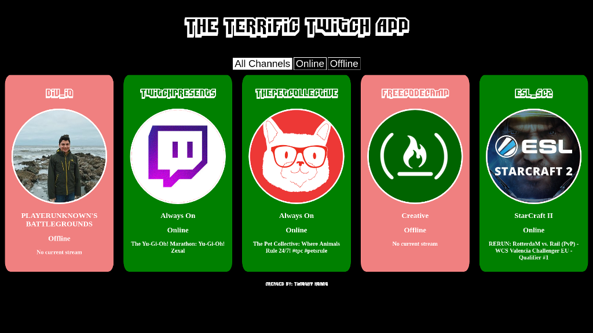

# 0027_twitch_app

<figure><figcaption style=" text-align: center;">Twitch App</figcaption></figure>

# About
- The Twitch App displays the channel's streaming status and information from Twitch API with assistance of Fetch API/promises
- This was built as part of the Free Code Camp front-end curriculum

## Features
- At quick glance, see what channels are online based on color
- Filter by all, online, and offline channels
- Visit each channel quickly by clicking on the cards

## Technologies
- [Twitch API](https://dev.twitch.tv/) for retrieving channel information
- [Flexbox](https://developer.mozilla.org/en-US/docs/Learn/CSS/CSS_layout/Flexbox) for responsiveness and layout